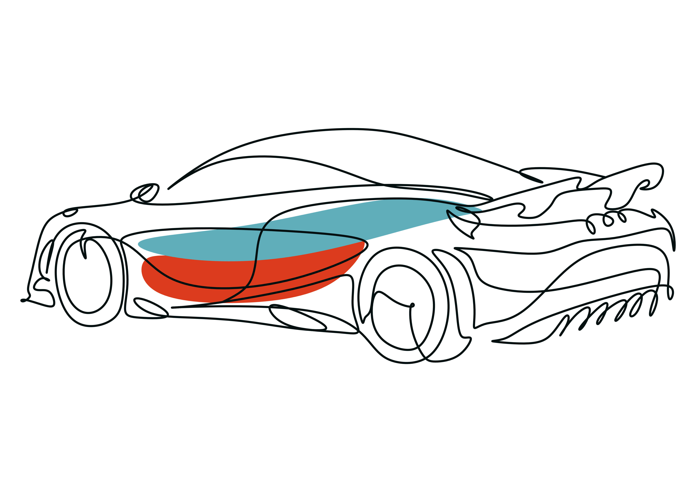

<p align="center">
  
</p>

<h1 align="center">Stathmos</h1>
<p align="center">
  <strong>Sistema Integral de Gestión de Talleres Automotrices</strong><br/>
  <em>Mantener la eficiencia es lo esencial.</em>
</p>

<p align="center">
  
  
  
  
  
  
  
</p>

---

## ¿Qué es Stathmos?

Stathmos es una plataforma web integral para talleres automotrices mexicanos. Digitaliza y centraliza todo el ciclo de vida de un servicio vehicular: desde que el cliente agenda una cita hasta que recoge su carro con la factura en mano.

Corre como **aplicación de escritorio** para el administrador y como **PWA instalable** para mecánicos y clientes, todos conectados en tiempo real a través de una base de datos centralizada en Supabase.

---

## Funcionalidades principales

| Módulo | Descripción |
|--------|-------------|
| 🔐 **Autenticación** | Login con roles (admin / mecánico / cliente), recuperación de contraseña, dark mode automático |
| 👥 **Gestión de usuarios** | Registro de clientes con validación RFC/SAT, alta de empleados con invitación por email |
| 🚗 **Proyectos / Tickets** | Ciclo completo: ingreso → diagnóstico → cotización → pago → entrega, con fotos y PDF |
| 🔧 **Diagnósticos** | Registro técnico con síntomas, hallazgos y causa raíz, con notificación automática al cliente |
| 📅 **Citas** | Agendamiento con validación de disponibilidad, horarios del taller y días inhábiles |
| 📦 **Inventario** | Catálogo de refacciones, compras a proveedores, ventas, alertas de stock bajo |
| 💳 **Pagos** | Integración con Stripe, múltiples métodos, generación automática de factura |
| 📊 **Reportes** | Financiero (ingresos, egresos, utilidad) y operativo (productividad, rotación), exportables a PDF |
| 📁 **Historial y auditoría** | Historial completo por rol, búsqueda avanzada, exportación |
| 🔔 **Notificaciones** | Tiempo real en cambios de estado, citas y diagnósticos |

---

## Stack tecnológico

**Frontend**
- [React 19](https://react.dev) + [Vite 7](https://vitejs.dev)
- [Tailwind CSS v4](https://tailwindcss.com)
- [Framer Motion](https://www.framer.com/motion/) — animaciones
- [React Router v7](https://reactrouter.com)
- [Lucide React](https://lucide.dev) + [React Icons](https://react-icons.github.io/react-icons/)
- [jsPDF](https://github.com/parallax/jsPDF) + [html2canvas](https://html2canvas.hertzen.com) — exportación a PDF

**Backend / BaaS**
- [Supabase](https://supabase.com) — PostgreSQL, Auth, Storage, Realtime
- 14 Edge Functions (Deno) para lógica de negocio crítica
- [Stripe](https://stripe.com) — procesamiento de pagos

**Infraestructura**
- [Vercel](https://vercel.com) — deploy con Speed Insights
- PWA con `vite-plugin-pwa` — instalable en móvil

---

## Estructura del proyecto

```
Stathmos.web/
├── src/
│   ├── App.jsx                  # Routing principal y lógica global
│   ├── Login.jsx
│   ├── CambiarContrasena.jsx
│   ├── CompletarRegistro.jsx
│   ├── supabase.js              # Cliente de Supabase
│   ├── components/              # 24 módulos de UI
│   │   ├── UIPrimitives.jsx     # Design system interno
│   │   ├── CitasModule.jsx
│   │   ├── Ticket.jsx
│   │   ├── GestionInventario.jsx
│   │   ├── ReporteFinancieroModule.jsx
│   │   └── ...
│   ├── hooks/
│   │   └── UseSupabaseRealTime.jsx
│   └── utils/
│       └── datetime.js
├── supabase/
│   └── functions/               # 14 Edge Functions
│       ├── agendar-cita/
│       ├── crear-cliente/
│       ├── crear-empleado/
│       ├── gestionar-inventario/
│       ├── enviar-notificacion/
│       ├── crear-pago/
│       ├── autorizar-pago/
│       ├── resolver-cotizacion/
│       └── ...
├── BD_StathmosOriginal.sql      # Schema completo de la base de datos
├── BD_AuthTriggers.sql          # Triggers de autenticación
└── vercel.json
```

---

## Instalación local

### Prerrequisitos
- Node.js 18+
- Cuenta en [Supabase](https://supabase.com)
- Cuenta en [Stripe](https://stripe.com)

### Pasos

```bash
# 1. Clonar el repositorio
git clone https://github.com/EmilianoOsuna/Stathmos.web.git
cd Stathmos.web

# 2. Instalar dependencias
npm install

# 3. Configurar variables de entorno
cp .env.example .env
# Editar .env con tus credenciales

# 4. Aplicar el schema de base de datos
# Ejecutar BD_StathmosOriginal.sql y BD_AuthTriggers.sql en tu proyecto de Supabase

# 5. Levantar el servidor de desarrollo
npm run dev
```

### Variables de entorno requeridas

```env
VITE_SUPABASE_URL=https://tu-proyecto.supabase.co
VITE_SUPABASE_ANON_KEY=tu-anon-key
```

---

## Roles del sistema

```
Administrador  →  Acceso completo: proyectos, inventario, reportes, usuarios
Mecánico       →  App móvil: trabajos asignados, diagnósticos, fotos, refacciones
Cliente        →  App móvil: citas, seguimiento de su vehículo, historial de servicios
```

---

## Edge Functions desplegadas

| Función | Propósito |
|---------|-----------|
| `agendar-cita` | Valida disponibilidad y crea cita |
| `crear-cliente` | Registra cliente + usuario en Supabase Auth |
| `crear-empleado` | Registra empleado con rol asignado |
| `gestionar-inventario` | Actualiza stock en compras y ventas |
| `enviar-notificacion` | Notificaciones en tiempo real |
| `crear-pago` | Registra pago y genera factura |
| `autorizar-pago` | Procesa cobro con Stripe |
| `resolver-cotizacion` | Aprueba o rechaza cotización |
| `reintegrar-cotizacion` | Revierte cotización rechazada |
| `resolver-cita` | Confirma o cancela cita |
| `crear-dia-inhabil` | Marca días sin atención |
| `eliminar-dia-inhabil` | Elimina día inhábil |
| `listar-dias-inhabiles` | Lista días configurados |
| `setup-admin` | Configuración inicial del administrador |

---

## Equipo de desarrollo

Proyecto desarrollado como proyecto integral del semestre en el **Instituto Tecnológico de Tepic** — Ingeniería en Sistemas Computacionales.

<table>
  <tr>
    <td align="center">
      <a href="https://github.com/EddieAltamirano11">
        <br/>
        <sub><b>Eddie David Altamirano Plantillas</b></sub>
      </a>
    </td>
    <td align="center">
      <a href="https://github.com/EmilianoOsuna">
        <br/>
        <sub><b>Carlos Emiliano Osuna Langarica</b></sub>
      </a>
    </td>
    <td align="center">
      <a href="https://github.com/Moch236">
        <br/>
        <sub><b>Karla Natalia Jara Alvarez</b></sub>
      </a>
    </td>
    <td align="center">
      <a href="https://github.com/LuisonTwentyThree">
        <br/>
        <sub><b>Luis Carlos Durán Ocampo</b></sub>
      </a>
    </td>
    <td align="center">
      <a href="https://github.com/Liz-Kalu">
        <br/>
        <sub><b>Karime Lizbeth Rendón Vázquez</b></sub>
      </a>
    </td>
  </tr>
</table>

---

<p align="center">
  <strong>Stathmos</strong> · TecNM Campus Tepic · Ingeniería en Sistemas Computacionales · 2026
</p>